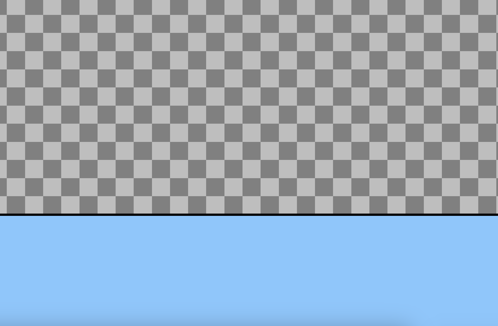

# Entry 2
##### 12/9/24

Since the last blog, I have tinkered with the tool I confirmed to stick to for the remainder of the Freedom Project: KaboomJS. I looked over the [documentation](https://kaboomjs.com/) provided by the developers and also watched videos made by experts, and with my imported repository from last time, I learned various components while following a tutorial to build a startup game, which was a regular obstacle course where a user would continuously move to the left and jump to progress.

To start with creating the game for my tinkering process, I made a new platform so that the default sprite could land on a static body and not through the map. I used `add()`, and within it, I included a rectangle with the  dimensions `(width(), 48)`. Additionally, to make the floor static, I used the `body()` component and within the parenthesis, I added `{ isStatic: true }`. I also positioned the platform using `pos()` and the following attributes: `0, height() - 48`. This made it so the platform would touch the bottom of the screen like this:

The new components I first learned were loops and body. I used these components to create an infinite loop of obstacles. After looking at the tutorial documentation, I created a loop of one second. Within the loop, I added `rect()` with a width of 48 and a height of 64. In addition, I added color to the rectangle using RGB values in the syntax of ` color(215, 120, 142),`. To make the screen continuously move in a diretion, I used the `move()` and put a left direction in the parenthesis followed by a value of 280, which is separated by a comma. This allowed the sprite to move to the left at 280 pixels per second. I added `player.OnCollide` and added a keyword of "tree", which I also followed the same procedure for the rectangle inside the loop.

At last, I focused on the user sprite properties along with an end screen. As for the sprite, I wanted it so that a user can jump when they press the space button. In the documentary, I found that the event component `OnKeyPress()` could be used. I used the same syntax provided on the blog, and I inserted "space" as my key value. Inside the brackets, I added `smiley.jump()` to make the sprite, which I loaded into the game scene, have the ability to jump. As for the losing screen, I created a new scene using the `scene()` component which I gathered from the tutorial document. I named scene "lost" and within the brackets, I put an `add()` component along with the text "Game Over!". I added `go("lost")` on the `player.OnCollide` code to transition into the losing scene. I did the same for a starting scene, but instead of writing a text within the `add()` component, I placed `sprite()` for the user character to spawn. I used the `go()` component in the end and added "Game" so that a user can replay the game. I also added all of the existing game functions within the "Game" scene.

#### Break Overview
My overall tinkering process was insightful in the long-run as I can see how some components can fit into my Freedom Project with Kyle. For instance, `go()` and `scene()` would be two main components of my Kaboom game. Sprites and `add()` would also be heavily used as it is the core of the interactive game. Over the break, I will create a new level with an additional sprite that can move with unique keybinds.

#### EDP
Currently, I am on the second stage of the Engineering Design Process: Research the Problem. I am still researching the attention span problem in an educational setting. Additionally, I am also conducting further analysis to find specific causes to the issue. By the time I reach stage three, I will include my research findings to develop a solution to the problem.

#### Skills
##### Effectively Evaluating Documents
While tinkering with KaboomJS, I looked on the documentation provided by the developers and to learn the tool, I needed to navigate through a multiface of components with a variety of explanations that sums the syntaxes. In other words, I needed to evalute the contents effectively so I could make the best out of my tinkering process.

##### Management
Tinkering with a new tool is difficult since you have to learn everything from scratch. Especially all of the components that makes up the tool is overwhelming. While I already had some knowledge from tinkering to solidify a tool, I was still at a basic level. There were more components I needed to learn and so I started to manage my work, whether it is time or organization, in order to learn productively.

[Previous](entry01.md) | [Next](entry03.md)

[Home](../README.md)
