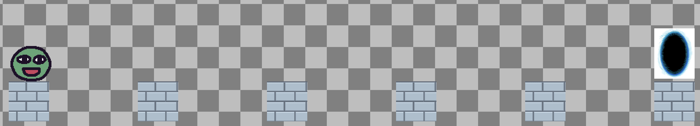

# Entry 3
##### 2/3/25

Ever since the last blog, I continued to tinker using Kaboom to learn more complex concepts using the same [documentation](https://kaboomjs.com/blog) provided by the developers. During the winter break, I added more features and revisions to the startup game I previously made with weeks of learning by browsing tutorials on the Kaboom website that displayed syntax and functionality for every component.

Beginning with the tinkering process, I focused on creating separate levels with new obstacles. A large revision I made was deleting the base level that I created, which contained an infinite loop of reoccurring obstacles. Instead, I rearranged the structure of the entire level and added a new block and portal sprite, and loaded it into my game scene using `loadSprite("block", "sprites/block.png")` and `loadSprite("pov", "sprites/portal.jpg")`. I made it so that a user had to go past an obby and enter a portal to transition to another level.

I referred to the documentation and found that I needed to create a new variable that included the level structures, in which the sprites were represented as symbols. I named it `LEVELS`. Inside it, I delegated symbols to the sprites, "@" became the user character, ">" represented the portal, and "=" were the blocks. I added opening and closing brackets ([]) within the variable and inside it, I added the symbols in the way I wanted the levels to be laid out:

``` JS
const LEVELS = [
  [
        "@				  ",
		"				           > ",
        "=  =  =  =  =  = ",
  ],
]
```

My starting level looked like this:



Additionally, I started to add more opening and closing brackets in the variable to add more levels. To make the portal work, I created a new tag "portal" and gave it to the sprite. Then, I added a new `.onCollide` so that when the user hits "portal", it would run the code `if (levelIdx < LEVELS.length - 1) {go("game", { levelIdx: levelIdx + 1, score: score + 1,})`, which ultimately checks to see whether there are more levels or not and goes to a new one if there is. If not, then `go("win", { score: score })` would run and the user wins the game.

Recently, I merged files with my partner. We believed that both of us knew enough to start colloboration on a single project. Together we incorporated both of our levels, sprites, and game conditions to form an in-depth interactive play. An addition to the game we formed was spikes. My partner loaded his sprite and gave it the symbol "/" to represent it in the levels. I added a new tag "danger" and gave it to the sprite. With a new `.onCollide`, I made sure that when a user hit the sprite, the code `go("lose", { score: score })` would run, sending them to a losing screen with an end score. My next goal is to add sound effects (death and jump) into the game scene with the progress already made.

#### EDP
As of right now, I am in the third on the Engineering Design Process: Brainstorm Possible Solutions. Now that I learned the concept of creating levels using Kaboom, there are more possible solutions that I can brainstorm with my partner to solve the issue of attention spans in education. I can add a set of engaging levels that could aim to educate users in various subjects while also hooking them in to prevent more doomscrolling. The brainstorming process will help my partner and I choose from a list of innovative problem-solvers by the time we reach stage four, which is to plan a final solution.

#### Skills
##### Extracting Useful Information
During my tinkering process, I had to refer to the Kaboom documentation as my main assistance tool. There are many components and explanations provided on the website which is overwhelming for a beginner learning the tool. To make the best of my researching process, I skimmed through most information and only gathered ones that were relevant and useful for my learning. This allowed me to learn at an efficient manner.


##### Organization
While working with my partner, I merged works and creatd a single repository where we could both collaborate. In doing so, I had to be organized because beforehand, my partner and I both had invididual games. We took specific parts from our own files and created an improvised game. Being organized allowed us to work with less issues.


[Previous](entry02.md) | [Next](entry04.md)

[Home](../README.md)
